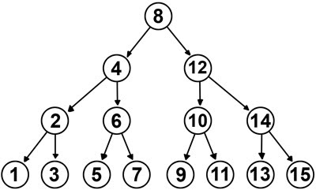

# Árvore Binária de Busca 🎄

  

# Árvore Binária de Busca + Python 🌳

> ## Descrição 📚
Este projeto é desenvolvido na trilha Foundations na edição NLW IA. A aplicação denominada Shorts Summary é um aplicativo concebido para processar links de Shorts do YouTube, efetuando a transcrição automática do áudio para texto. Posteriormente, fornece ao usuário um resumo textual do conteúdo. O processo integral é conduzido por meio de inteligência artificial, com destaque para a utilização da tecnologia Whisper da OpenAI, empregada no processo de transcrição automática.

 
 

> ## Tecnologias 👨🏾‍💻
Foram utilizadas as seguintes tecnologias neste projeto:
+ Front-End :
  -  HTML5
  -  CSS3
  -  JavaScript
  -  Axios
+ Back-End:
  - JavaScript + Node.Js
  - Express.Js
  - Cors (Cross-Origin Resource Sharing)
+ Animate on Scroll:
  - Framework para aplicação de animações nos componentes quando são expostos na tela pelo uso da scrollbar.

 
 

> ## Printscreen do Projeto 📸

 
 

> ## Autor 📝
+ [Ruan Cardoso](https://github.com/RuanCxrdoso)
