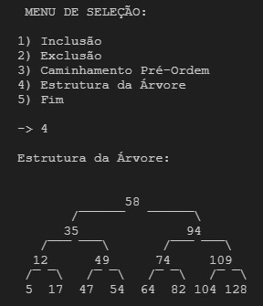

# Árvore Binária de Busca 🎄

  

# Árvore Binária de Busca + Python 🌳

> ## Descrição 📚
Desenvolvi uma árvore binária de busca utilizando princípios de Programação Orientada a Objetos (POO), implementando métodos de inserção e exclusão. A estrutura da árvore permite a busca de elementos, o que é fundamental para dar suporte aos métodos de inserção e exclusão.
Para a busca, foram implementados métodos que percorrem a árvore, auxiliando na identificação do local adequado para inserção e na localização do elemento a ser removido. Esses métodos contribuem para a manutenção da propriedade de ordenação da árvore binária de busca.
Além disso, desenvolvi um percorrimento pré-ordem iterativo, utilizando uma pilha encadeada como estrutura de suporte. Esse percurso permite visitar os nós da árvore na ordem raiz, esquerda, direita, sem a necessidade de recursão.
Implementei um método de impressão da estrutura da árvore, facilitando a visualização da organização dos elementos. Esse método pode ser útil para depurar o código e compreender melhor o funcionamento da árvore.
Criei um menu interativo que oferece ao usuário cinco opções: inserção de um novo elemento na árvore, remoção de um elemento utilizando o percurso pré-ordem, percorrimento pré-ordem iterativo, exibição da estrutura da árvore e fim para encerrar o programa.
Essa abordagem modular e orientada a objetos facilita a manutenção e expansão do código, promovendo uma organização mais clara e reutilização de código. O menu interativo proporciona uma experiência amigável ao usuário, permitindo a execução de diversas operações na árvore binária de busca de maneira intuitiva.

 
 

> ## Tecnologias 👨🏾‍💻
Foram utilizadas as seguintes tecnologias neste projeto:
+ Linguagem:
  - Python

 
 

> ## Printscreen do Projeto 📸

  

 
 

> ## Autor 📝
+ [Ruan Cardoso](https://github.com/RuanCxrdoso)
